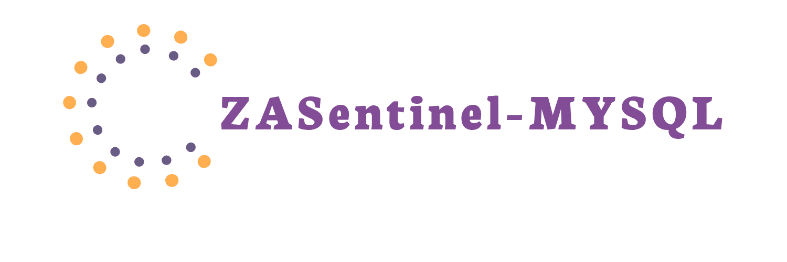
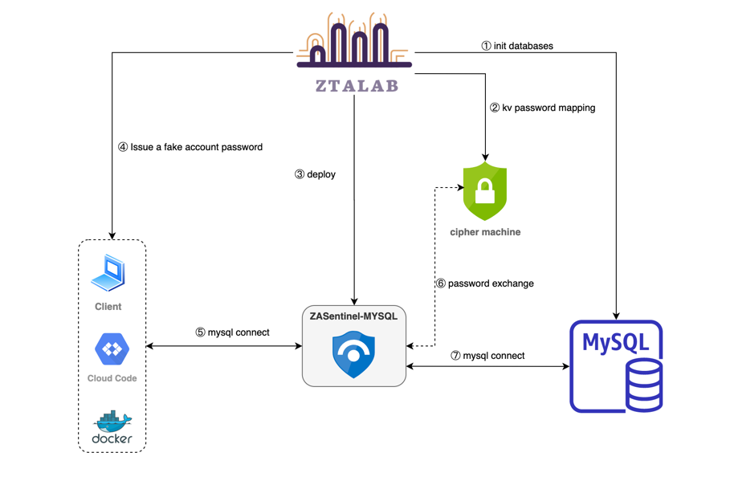
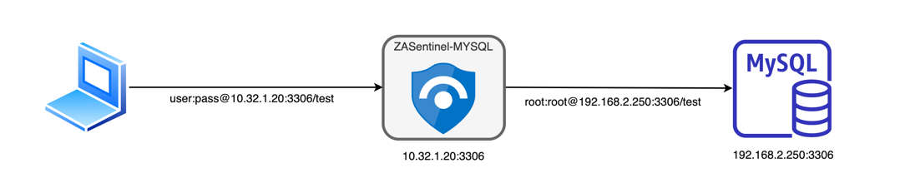
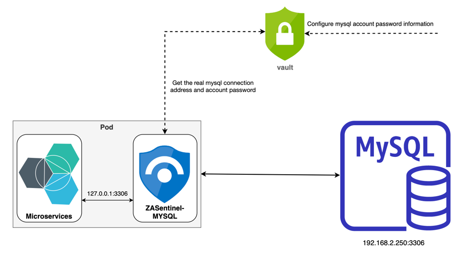

# ZASentinel-MYSQL
[](https://opensource.org/licenses/Apache-2.0) [](https://github.com/ztalab/ZASentinel-MYSQL/blob/master/go.mod)


**⭐ The zero-trust security component in the MYSQL environment enhances the security of MYSQL data access in a non-intrusive form.**




## 💪🏻 Features
1. Powerful performance and extremely low resource consumption
2. Only parse the authentication protocol message, after the authentication is successful, the command executes and responds to the transparent proxy, which is fast
3. Hide mysql itself, hide mysql authentication account password
4. Compatible with mysql 5.x ~ mysql 8.0
5. Easy access, no need to do any adaptation work, just fill in the correct address
6. Support vault secret storage component
----


## Get Started

```shell
git clone github.com/ztalab/ZASentinel-MYSQL

make && make install
```


### 👋 Example of use 

### Use mode 1: Provisional authorization
When you need to temporarily authorize a developer or operation and maintenance personnel to access the mysql database, and withdraw the permission after he completes his work;
With the help of ZASentinel-MYSQL agent program, the real mysql database connection can be hidden and the security of mysql database can be guaranteed.
Just issue a ZASentinel-MYSQL agent connection address and fake username and password to developers or operation and maintenance personnel for their work;
When you decide to revoke the privileges, they will lose any relevant information about the mysql database




#### Example configuration 

```yaml
server:
  # ZASentinel-MYSQL listen address
  # This address needs to be known to operations or developers
  addr: ":3306"

# mysql database authorized for temporary access
confidential:
  storage: yaml # yaml、vault
  yaml:
    # Real access address and account password
    host: 192.168.2.250
    port: 3306
    username: root
    password: root
    dbname: test
# Fake account passwords told to ops or developers
fakeIdentity:
  username: user
  password: pass
```

#### Run
Write the above configuration into the config.yaml file, and then execute:

```shell
za-mysql -c config.yaml
```


#### Last
Finally, send the connection information of the ZASentinel-MYSQL agent and the fake account 
password to the operation and maintenance or developer,
When you need to take back the permissions, you just need to stop running za-mysql

----


### Use mode 2: Sidecar
Assuming that there are many microservices connected to a mysql database in a system, 
the traditional approach is to generate a user identity for different microservices,
When deploying this microservice, write the connection information and authentication 
identity of mysql into the environment variable or configuration file of the microservice,
In this way, the security of the connection address and account password cannot be guaranteed, 
for example:
- Error messages or logs leaking mysql configuration information due to code crashes
- The code is not standardized, and the mysql configuration information is leaked after being penetrated by the attack
- After the connection address is leaked, blasting attacks can be carried out on the mysql database itself to affect other microservices

Now there is a good solution, deploy a ZASentinel-MYSQL at the near end of each microservice to act as a mysql proxy, ZASentinel-MYSQL only listens to the intranet address (for example: 127.0.0.1), and creates a fake account password; when deploying microservices, inject the connection information of ZASentinel-MYSQL; When the microservice performs mysql operation, it will only connect to ZASentinel-MYSQL, and the microservice will not directly connect to the mysql database, so even if the connection information is leaked due to the microservice's own problems, It is also impossible to execute an attack with this false information. ZASentinel-MYSQL supports obtaining the account password and connection information of the mysql database from the vault confidential storage component at startup. These sensitive information is stored in its own memory, which can greatly ensure the security of the information



#### Example configuration

```yaml
server:
  # ZASentinel-MYSQL listen address
  # This address needs to be known to operations or developers
  addr: ":3306"

# mysql database authorized for temporary access
confidential:
  storage: vault # yaml、vault
  vault:
    addr: http://xxxx:8200
    token: xxx
    dataPath: service1
# Tell the fake account and password of the microservice
fakeIdentity:
  username: user
  password: pass
```

#### Deployment steps
1. First create the identity information to access the mysql database

2. Pre-register the connection and identity information of mysql into the vault component (if you do not use the vault component, write it into the configuration file when deploying ZASentinel-MYSQL). The connection information is as follows:

   ```shell
   host: 192.168.2.250
   port: 3306
   username: root
   password: root
   dbname: test
   ```
3. Deploy microservices and ZASentinel-MYSQL, inject fake mysql connection information into microservices, for example:

   ```shell
   host: 127.0.0.1
   port: 3306
   username: user
   password: pass
   dbname: test
   ```

   

#### Last
Now your mysql database has been securely protected, and no microservice has its real connection address and authentication identity information


## 🗣️ Discussion

### Discussions Page

You can discuss or ask for help in [discussions](https://github.com/ztalab/ZASentinel-MYSQL).


## 😃 Contribute

### Bug Reports / Feature Requests
If you want to report a bug or request a new feature. Free feel to open a [new issue](https://github.com/ztalab/ZASentinel-MYSQL/issues).


## License

ZASentinel-MYSQL is under the Apache 2.0 license. See the LICENSE directory for details.