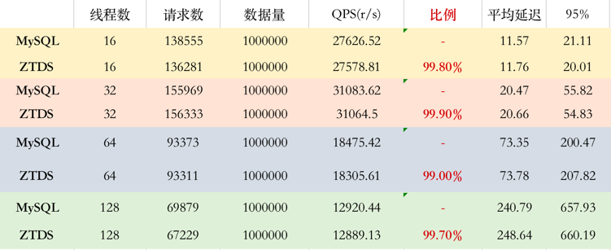
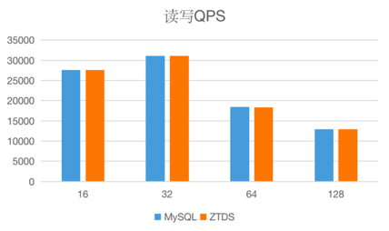
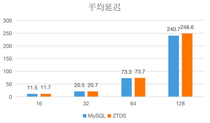

| **类别** | **名称**              |
| -------- | --------------------- |
| OS       | 主机 ubuntu20.04      |
| CPU      | AMD Ryzen 7 4800H * 8 |
| RAM      | 16GB                  |
| DISK     | 256GB                 |
| Mysql    | v5.7                  |
| sysbench | v0.5                  |

借助sysbench压测工具，分别在16、32、64、128线程下压测直连mysql和通过ztamysql代理连接mysql。观察使用ztamysql代理时的性能损耗。
可观察到在使用ztamysql代理时几乎无性能损耗，qps保持在直连的99%以上，平均延时增加基本在毫秒级以下。
